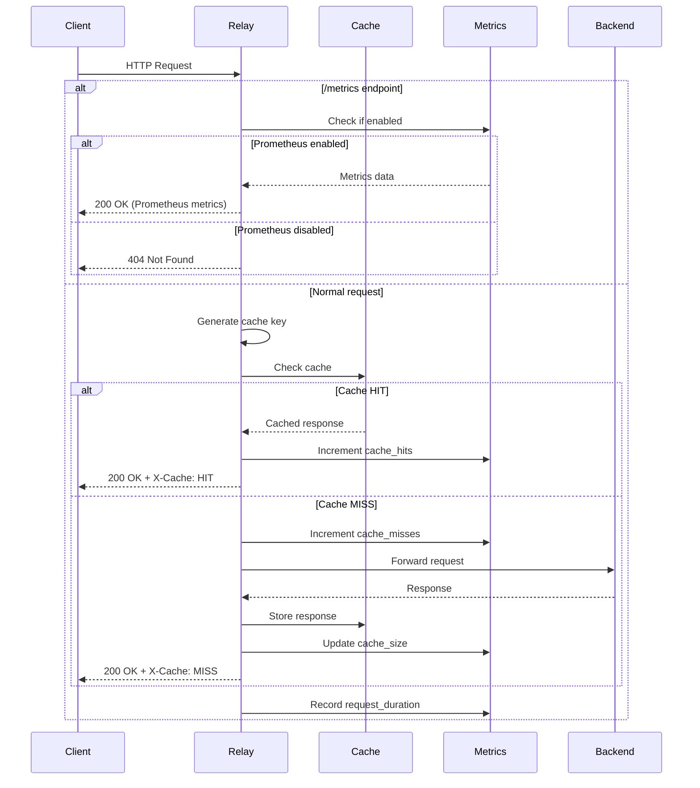

# Architecture

Understanding Relay's internal architecture.

## High-Level Overview

### Component Architecture

```
┌─────────────┐
│   Client    │
└──────┬──────┘
       │
       ▼
┌─────────────────────────────┐
│         Relay               │
│  ┌────────────────────────┐ │
│  │   HTTP Server          │ │
│  └───────┬────────────────┘ │
│          │                  │
│  ┌───────▼────────────────┐ │
│  │   Cache Layer          │ │
│  │  - Key generation      │ │
│  │  - TTL management      │ │
│  │  - Stale handling      │ │
│  └───────┬────────────────┘ │
│          │                  │
│  ┌───────▼────────────────┐ │
│  │   Storage Backend      │ │
│  │  - Memory              │ │
│  │  - Redis               │ │
│  │  - Disk                │ │
│  └───────┬────────────────┘ │
│          │                  │
│  ┌───────▼────────────────┐ │
│  │   Upstream Client      │ │
│  └────────────────────────┘ │
└─────────────┬───────────────┘
              │
              ▼
       ┌─────────────┐
       │   Backend   │
       └─────────────┘
```

### Request Flow Diagram



## Core Components

### 1. HTTP Server

**Technology**: `tokio` + `hyper`

Handles incoming HTTP requests:
- Request parsing
- Header processing
- Routing
- Response streaming

```rust
async fn handle_request(req: Request) -> Response {
    // 1. Parse request
    // 2. Check cache
    // 3. Fetch from upstream if needed
    // 4. Update cache
    // 5. Return response
}
```

### 2. Cache Layer

**Core Logic**: Cache key generation, TTL, and invalidation

#### Cache Key Generation

```rust
fn generate_cache_key(req: &Request, config: &Config) -> String {
    // 1. Normalize URL
    // 2. Filter query params
    // 3. Include relevant headers
    // 4. Hash if needed
}
```

#### Cache Decision Flow

```
Request
   │
   ▼
Check cache
   │
   ├─ HIT ──────┬─ Fresh? ── Return cached
   │            │
   │            └─ Stale? ─┬─ Within stale-while-revalidate?
   │                       │  ├─ Yes ─ Return stale + revalidate in background
   │                       │  └─ No ── Fetch fresh
   │
   └─ MISS ───── Fetch from upstream
```

### 3. Storage Backends

#### Storage Abstraction

```rust
#[async_trait]
pub trait Storage: Send + Sync {
    async fn get(&self, key: &str) -> Result<Option<CachedResponse>>;
    async fn set(&self, key: &str, value: CachedResponse, ttl: Duration) -> Result<()>;
    async fn delete(&self, key: &str) -> Result<()>;
    async fn exists(&self, key: &str) -> Result<bool>;
    async fn size(&self) -> Result<usize>;
}
```

#### Implementations

1. **MemoryStorage**
   - Uses `DashMap` for concurrent access
   - LRU eviction
   - Size-limited

2. **RedisStorage**
   - Uses `redis-rs`
   - Connection pooling
   - Compression support

3. **DiskStorage**
   - File-based storage
   - Content-addressed
   - Async I/O

### 4. Upstream Client

**Technology**: `reqwest`

Manages communication with origin servers:
- Connection pooling
- Timeout handling
- Error handling
- Conditional requests

```rust
async fn fetch_from_upstream(
    req: &Request,
    cached: Option<&CachedResponse>
) -> Result<Response> {
    // Send conditional request if we have cached version
    if let Some(cached) = cached {
        add_conditional_headers(req, cached);
    }

    client.send(req).await
}
```

## Request Flow

### Cache Hit (Fresh)

```
1. Client request
2. Generate cache key
3. Storage.get(key) → Some(response)
4. Check TTL → Fresh
5. Return cached response
```

### Cache Hit (Stale with Revalidate)

```
1. Client request
2. Generate cache key
3. Storage.get(key) → Some(response)
4. Check TTL → Stale (within revalidate window)
5. Return cached response
6. Background: Fetch fresh from upstream
7. Background: Update cache
```

### Cache Miss

```
1. Client request
2. Generate cache key
3. Storage.get(key) → None
4. Fetch from upstream
5. Storage.set(key, response)
6. Return response
```

## Concurrency Model

### Async Runtime

- Uses `tokio` for async I/O
- Worker pool per CPU core
- Non-blocking operations

### Cache Stampede Prevention

```rust
// Use per-key locks to prevent duplicate fetches
let lock = locks.get_or_insert(key);
let _guard = lock.lock().await;

if let Some(cached) = storage.get(key).await? {
    return Ok(cached);
}

// Only one request fetches from upstream
let response = fetch_upstream().await?;
storage.set(key, response).await?;
```

## Configuration System

### Config Loading

```rust
1. Load from file (TOML)
2. Override with environment variables
3. Validate configuration
4. Build runtime config
```

### Config Hot Reload

Currently not supported - requires restart.

Future: Watch config file and reload on change.

## Metrics & Observability

### Metrics Collection

```rust
// Counter
CACHE_HITS.inc();

// Histogram
REQUEST_DURATION.observe(elapsed.as_secs_f64());

// Gauge
CACHE_SIZE.set(size as f64);
```

### Metrics Export

- Prometheus format at `/metrics`
- Lazy evaluation
- No overhead when not scraped

## Memory Management

### Cache Eviction

```rust
if cache_size > max_size {
    evict_by_policy(policy); // LRU, LFU, or FIFO
}
```

### Resource Limits

- Max cache size
- Max object size
- Connection pool size
- Request timeout

## Security Considerations

### Input Validation

- URL validation
- Header validation
- Size limits

### Cache Poisoning Prevention

- Validate responses before caching
- Respect Cache-Control directives
- Separate cache spaces for different contexts

## Error Handling

### Error Types

```rust
pub enum RelayError {
    CacheError(String),
    StorageError(String),
    UpstreamError(String),
    ConfigError(String),
}
```

### Error Recovery

1. **Cache errors**: Fall through to upstream
2. **Storage errors**: Serve stale if available
3. **Upstream errors**: Serve stale or return error
4. **Config errors**: Fail fast on startup

## Performance Optimizations

### Zero-Copy Operations

- Use `Bytes` for response bodies
- Avoid unnecessary cloning
- Stream responses when possible

### Connection Pooling

- Reuse upstream connections
- Reuse Redis connections
- Configurable pool sizes

### Compression

- Compress stored responses
- Decompress only when needed
- Configurable compression level

## Future Enhancements

### Planned Features

1. **HTTP/2 Support**
2. **Edge Side Includes (ESI)**
3. **GraphQL Caching**
4. **Distributed Cache Invalidation**
5. **Cache Warming**
6. **Advanced Routing**

### Roadmap

See [GitHub Issues](https://github.com/stephenfairchild/relay/issues) for details.
